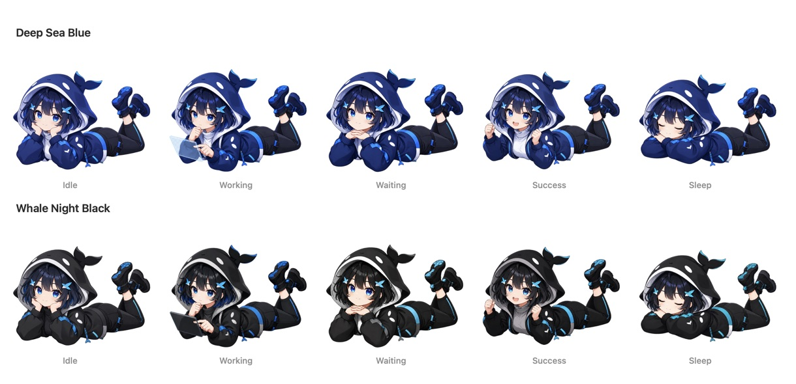

# Xiaozhuang DSH

English | [中文](README.zh.md)

Xiaozhuang DSH is a community, plugin-enhanced distribution built on [DeepSeek Harness](https://github.com/deepseek-ai/deepseek-harness). It keeps the upstream “everything is a plugin” foundation and adds product features that make local AI work easier to inspect, control, and extend.

> This is an independent community project, not an official DeepSeek release. Upstream architecture, license, and attribution remain intact.

[Download the latest release](https://github.com/niushuanan/xiaozhuang-dsh/releases/latest) · [View the upstream project](https://github.com/deepseek-ai/deepseek-harness)

## Why this distribution exists

DeepSeek Harness already provides a rich agent runtime, plugin composition, sessions, tools, model adapters, and a Web workspace. This repository does not replace that foundation. It develops additional capabilities as native plugins or narrow extension-point changes, so each feature can be understood, enabled, removed, and iterated independently.

The product priorities are straightforward: the core workflow must work, common failures must be recoverable, and the interface must remain compact enough for daily use.

## Included enhancements

| Area | What it adds |
| --- | --- |
| **Computer Use** | Native macOS desktop control, an isolated Playwright browser, connected Chrome control, and a resizable in-product browser workspace. |
| **Teamwork and parallel development** | Configurable Codex collaborators, isolated Git worktrees for independent tasks, separate review, and guarded integration back into the main workspace. |
| **Model usage** | A preloaded usage panel for DeepSeek, KIMI, GLM, and the signed-in GPT account, with explicit refresh, automatic refresh, quota windows, and reset times. |
| **Live session controls** | Agent preset changes during an existing conversation, model-aware reasoning defaults, and clearer placement for planning and team status. |
| **Plugin-ready composer** | A direct extension point for files, folders, commands, skills, and plugins without replacing the native composer workflow. |
| **Model input routing** | Explicit text and vision capability classification so native image models and tool-based vision fallbacks can coexist. |
| **Product companion** | A draggable cross-page whale companion with blue and black skins that reacts to running, waiting, completed, and idle task states. |

The implementation lives in ordinary DSH packages and profile patch layers instead of a parallel application. The main additions include [`packages/computer-use/`](packages/computer-use/), [`packages/client/ui-computer-use/`](packages/client/ui-computer-use/), [`packages/client/ui-provider-quota/`](packages/client/ui-provider-quota/), [`packages/client/ui-product-companion/`](packages/client/ui-product-companion/), and the subagent, conversation, preset, and plugin-loading extensions under [`packages/`](packages/).

### Computer Use workspace


### Model usage panel


### Whale Companion



Whale Companion stays present across product pages and follows the current task state. It shows the real response phase and browser-observed elapsed time, moves close to the active composer, and briefly celebrates completion. Click or drag it to interact directly; choose its blue or black skin and behavior in its dedicated Settings section, or hot-unplug it from Xiaozhuang's plugin center.

<a id="run"></a>

## Download and run

### Recommended: release bundle

Open [Releases](https://github.com/niushuanan/xiaozhuang-dsh/releases/latest) and download `xiaozhuang-dsh-v0.1.0-prebuilt-source.tar.gz`. The bundle contains the source plus the built Host, Client, and Web artifacts for the tagged commit, so it does not require a local build before the first launch.

Requirements:

- Node.js `^22.19.0` or `>=24.0.0`
- Corepack with pnpm `11.7.0`
- Git for development and Teamwork worktree features
- macOS Accessibility and Screen Recording permission only when desktop Computer Use is enabled

```sh
tar -xzf xiaozhuang-dsh-v0.1.0-prebuilt-source.tar.gz
cd xiaozhuang-dsh-v0.1.0
corepack enable
pnpm install --frozen-lockfile
pnpm dsh web
```

The Web UI starts at `http://127.0.0.1:3080` by default.

<a id="run-from-source"></a>

### Run from Git

```sh
git clone https://github.com/niushuanan/xiaozhuang-dsh.git
cd xiaozhuang-dsh
corepack enable
pnpm install --frozen-lockfile
pnpm run build:official
pnpm dsh web
```

## Configuration and privacy

The repository and release bundle contain no API keys, login sessions, account tokens, conversation data, or local DSH profile state. Configure model providers and grant operating-system permissions on your own machine. The model-usage plugin reads supported local account configuration at runtime and does not expose credentials to the browser.

Computer Use and external collaborators are optional capabilities. Their package READMEs document permissions, provider requirements, failure behavior, and known limitations.

## Continuous iteration

This repository will continue to publish plugin improvements that have already proven useful in daily local work. Upcoming iterations will focus on whole-machine token reporting, clearer runtime details, a more efficient composer menu, smoother streaming output, and easier installation of the curated plugin set.

New features remain plugin-first: they should solve a visible user task, preserve the upstream runtime, and stay removable without breaking unrelated workflows.

## Development and contribution

Read the [development guide](docs/development.md), [architecture documentation](docs/architecture.md), and [contribution guide](CONTRIBUTING.md) before changing packages. Upstream fixes should still be proposed to [DeepSeek Harness](https://github.com/deepseek-ai/deepseek-harness) when they are broadly applicable.

## License

[MIT](LICENSE). Third-party dependencies and licenses are listed in [THIRD_PARTY_NOTICES.md](THIRD_PARTY_NOTICES.md).
