# Xiaozhuang DSH

[English](README.md) | 中文

**用原生插件，把 DeepSeek Harness 变成更适合日常工作与聊天的本地 AI 工作台。**

[](https://github.com/niushuanan/xiaozhuang-dsh/releases/latest) [](https://github.com/topics/dsh-plugin) [](LICENSE) [](https://dshfind.com/plugins/niushuanan/xiaozhuang-dsh?ref=badge)

<p align="center">
  <a href="https://dshfind.com/plugins/niushuanan/xiaozhuang-dsh?ref=badge"></a>
</p>

[下载最新版本](https://github.com/niushuanan/xiaozhuang-dsh/releases/latest) · [查看全部插件](#plugins) · [给项目 Star](https://github.com/niushuanan/xiaozhuang-dsh) · [DeepSeek Harness 上游](https://github.com/deepseek-ai/deepseek-harness)

> 独立社区发行版，不是 DeepSeek 官方产品。保留上游架构、许可证和署名。

<p align="center">
  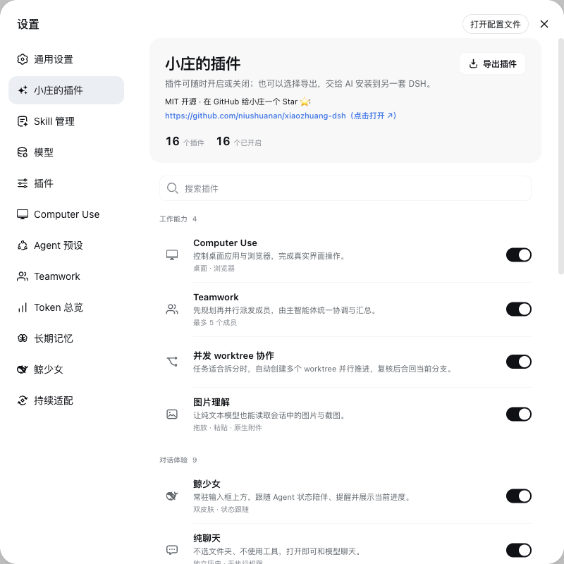
</p>

## 这是什么

Xiaozhuang DSH 保留 DeepSeek Harness 的 Agent、会话、工具、模型和插件主干，在同一个产品里补齐真实桌面操作、聊天模式、并行协作、Skill、长期记忆、用量观察和安全更新。新增能力优先做成可独立启停、导出和维护的原生插件。

| 开始工作 | 开始聊天 |
| --- | --- |
| 绑定工作区，使用 Agent、工具、权限和 Skill 完成任务。 | 不选文件夹、不授予执行权限，打开即可聊天并上传图片或文本。 |

## 你得到什么

| 用户任务 | 产品能力 |
| --- | --- |
| **在工作台里看清一切** | 右侧栏 + 底部面板：文件、编辑器、真实终端、Git、内嵌浏览器、后台任务与侧边对话，按会话隔离。 |
| **完成复杂工作** | Teamwork、多 Agent 和隔离 Git worktree 并行推进，主 Agent 统一汇总。 |
| **管理知识与上下文** | Skill 管理、划词引用、侧边聊天和两份可编辑的长期记忆。 |
| **保持对话顺手** | 聊天模式、DeepSeek 历史导入、多对话分屏、会话内模式切换、图片理解和连续输出。 |
| **看清模型消耗** | DeepSeek、KIMI、GLM、GPT 用量，以及会话和整机 Token 详情。 |
| **安全持续更新** | 每 6 小时检查上游，窄范围 Agent 处理兼容，空闲切换并支持回滚。 |

<a id="run"></a>

## 开始使用

### 推荐：发行包

[Xiaozhuang DSH v0.4.2](https://github.com/niushuanan/xiaozhuang-dsh/releases/tag/xiaozhuang-v0.4.2) 已包含构建好的 Host、Client 和 Web 产物。

```sh
tar -xzf xiaozhuang-dsh-v0.4.2-prebuilt-source.tar.gz
cd xiaozhuang-dsh-v0.4.2
corepack enable
pnpm install --frozen-lockfile
pnpm dsh web
```

[直接下载](https://github.com/niushuanan/xiaozhuang-dsh/releases/download/xiaozhuang-v0.4.2/xiaozhuang-dsh-v0.4.2-prebuilt-source.tar.gz) · [SHA-256](https://github.com/niushuanan/xiaozhuang-dsh/releases/download/xiaozhuang-v0.4.2/SHA256SUMS.txt)

<a id="run-from-source"></a>

### 从源码运行

```sh
git clone https://github.com/niushuanan/xiaozhuang-dsh.git
cd xiaozhuang-dsh
corepack enable
pnpm install --frozen-lockfile
pnpm run build:official
pnpm dsh web
```

要求 Node.js `^22.19.0` 或 `>=24.0.0`，pnpm `11.7.0`。Web 默认打开 `http://127.0.0.1:3080`。

<a id="plugins"></a>

## 17 个原生插件

在 **设置 → 小庄的插件** 中搜索、启停或选择导出。导出的 ZIP 包含源码、清单、哈希和 AI 安装说明。

### 工作能力

#### 01 · 侧边工作台

VSCode 风格右侧栏 + 底部面板：文件与编辑器、真实终端、Git 面板、支持显式网址／直接搜索模式的沙箱浏览器（拒绝嵌入时回退系统浏览器）、后台任务与 Codex 式侧边对话，全部按会话隔离、可拆分合并，并开放 `ctx.betterSidebar` 供后续插件注册页面。它的设置页与产品其余页面共用清晰的标题层级和无外围边框的扁平分区。

<p align="center">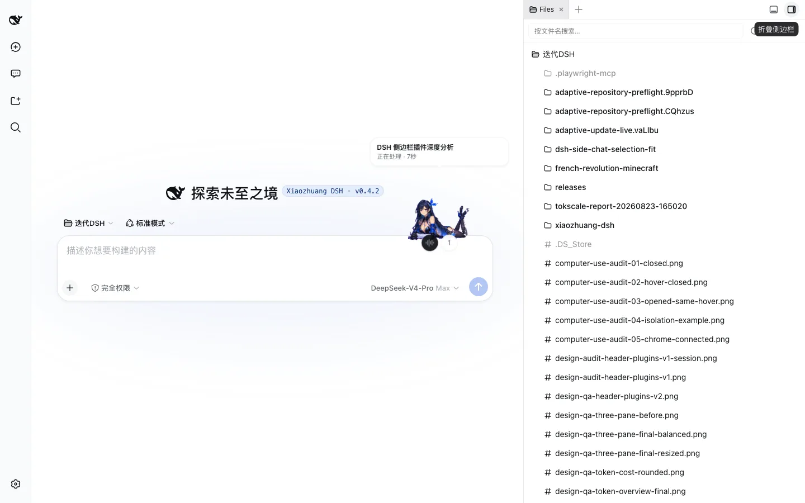</p>

#### 02 · Teamwork（[独立仓库](https://github.com/niushuanan/dsh-teamwork)）

原生 `subagent` 与 `subagent_fork` 负责常规并行任务；主 Agent 会把困难实现或独立复核选择性升级给可热插拔的 Codex、Z Code 外部专家，并通过同一套委派约定统一检查和汇总结果。关闭某位专家会同步移除可调用工具，重新开启即可恢复，无需重建工作流。

<p align="center">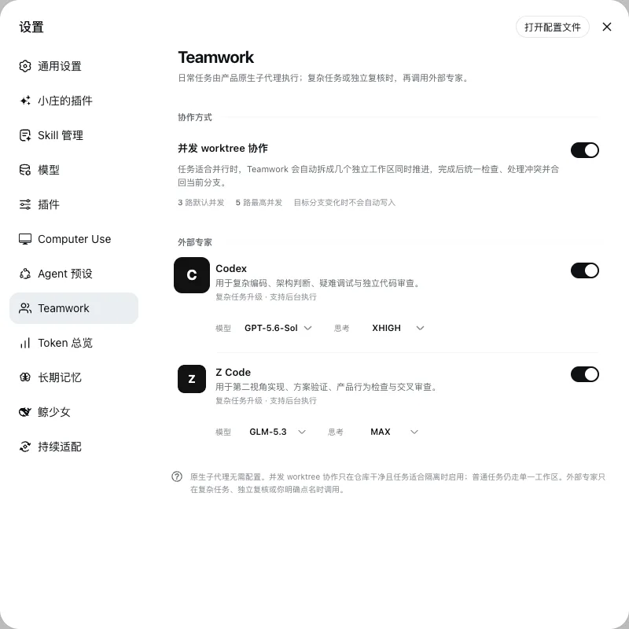</p>

#### 03 · 并发 worktree 协作（[独立仓库](https://github.com/niushuanan/dsh-parallel-worktree)）

把适合并行的任务放进隔离 Git worktree，完成后检查冲突并安全合回当前分支。

<p align="center"></p>

#### 04 · 图片理解（[独立仓库](https://github.com/niushuanan/dsh-image-vision)）

从输入框的加号直接上传图片，和命令、插件与 Skill 共用同一条最短入口。

<p align="center">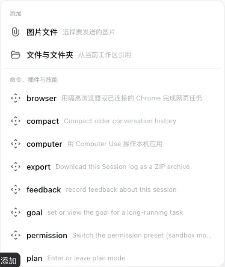</p>

### 对话体验

#### 05 · 鲸少女（[独立仓库](https://github.com/niushuanan/dsh-whale-girl)）

常驻输入框旁，集中提供一键换边、任务状态、语音听写和可配置的快捷动作。

<p align="center"></p>

#### 06 · 聊天模式（[组合仓库](https://github.com/niushuanan/dsh-chat-migration)）

不选文件夹、不授予 Agent 执行权限，打开即可和模型聊天，并保留文件上传与联网搜索入口。

<p align="center">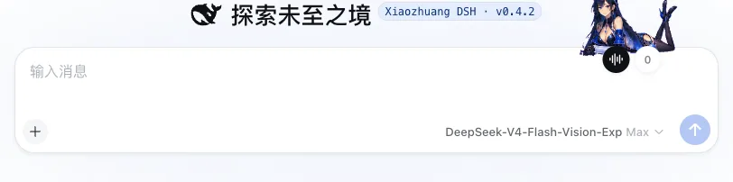</p>

#### 07 · 导入对话（[组合仓库](https://github.com/niushuanan/dsh-chat-migration)）

在**设置 → 导入对话**选择 DeepSeek 官方导出的 JSON 或 ZIP，先按 DeepSeek 的独立对话窗口预览、搜索和勾选，再把选中的原始顺序、标题、时间、回答和导出中已有的思维过程迁入原生聊天列表。已经导入的窗口会直接标记并跳过，不会生成副本。它和聊天模式分别启停、分别导出；组合仓库同时提供两项能力。

<p align="center">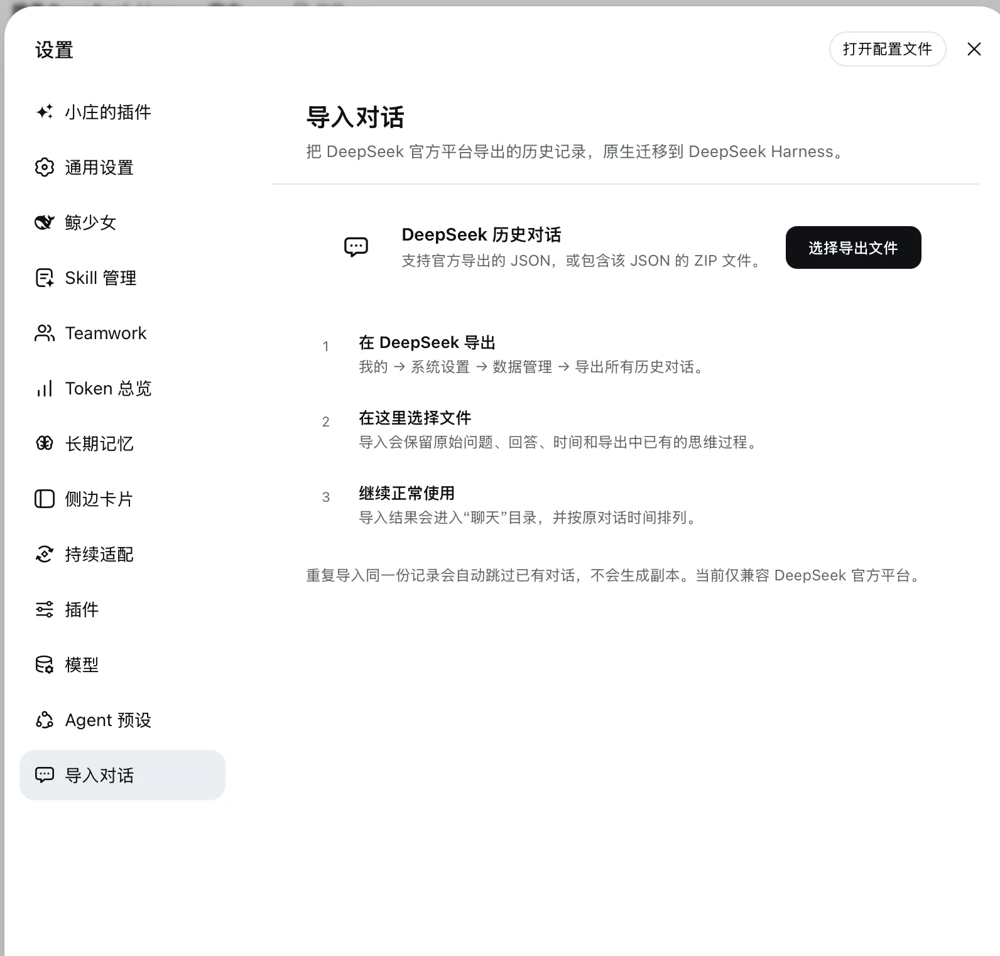</p>

#### 08 · 多对话分屏（[独立仓库](https://github.com/niushuanan/dsh-multi-window)）

把两个会话并排放进同一工作区，分别查看、输入和继续执行。

<p align="center">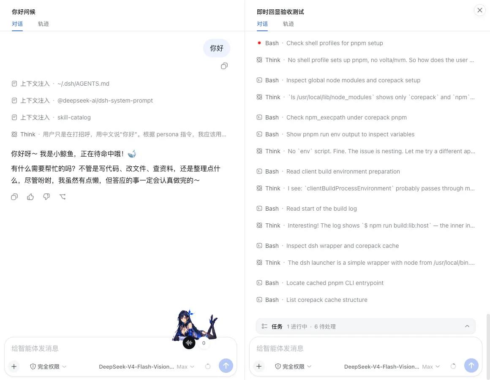</p>

#### 09 · 选中操作（[独立仓库](https://github.com/niushuanan/dsh-selection-memory)）

在回答里划词，原地引用、写入记忆或打开侧边聊天，不打断当前阅读。

<p align="center">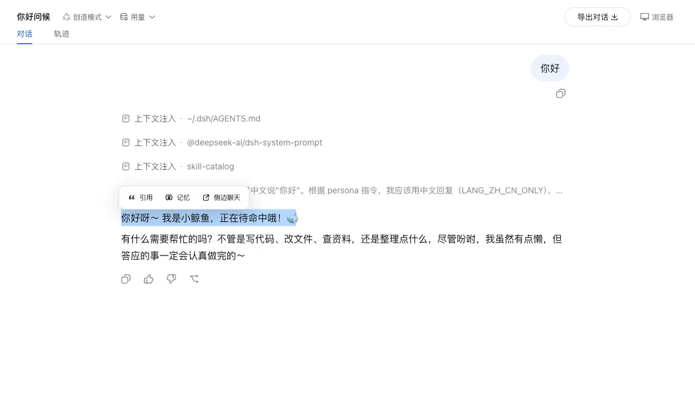</p>

#### 10 · 长期记忆（[独立仓库](https://github.com/niushuanan/dsh-selection-memory)）

分别维护“选中记忆”和“AI 主动记忆”两份全局文档，内容可见、可改、可恢复。

<p align="center">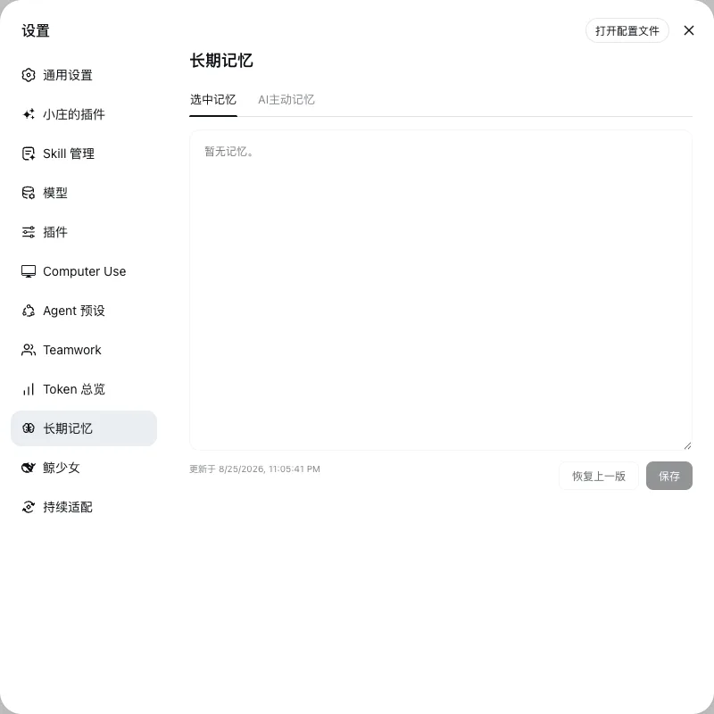</p>

#### 11 · 持续适配（[独立仓库](https://github.com/niushuanan/dsh-adaptive-update)）

每 6 小时检查上游，只让 Agent 处理必要兼容点，空闲切换，失败自动回滚。

<p align="center">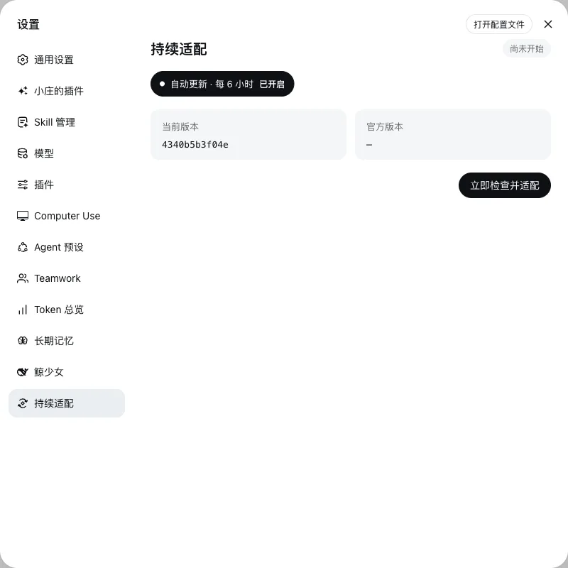</p>

#### 12 · Skill 管理（[独立仓库](https://github.com/niushuanan/dsh-skill-manager)）

直接查看 Skill 的分类、介绍、目录和文件内容，也能从文件、文件夹、ZIP 或 GitHub 自适应导入。

<p align="center">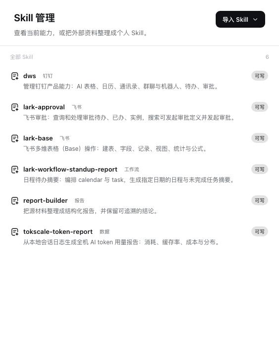</p>

#### 13 · 流畅输出

消息发送后立即进入对话，思考、工具和回答连续呈现，不再先空等状态变化。

<p align="center">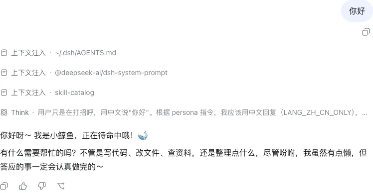</p>

#### 14 · Agent 预设

在会话中随时切换一整套工具、提示词和能力组合，也可以复制后自定义。

<p align="center">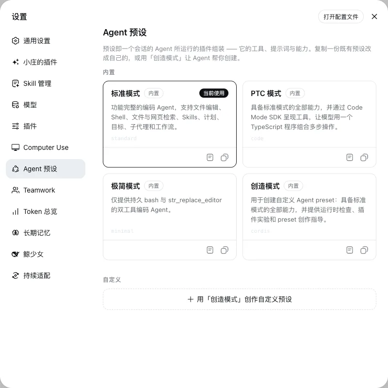</p>

### 数据与用量

#### 15 · 模型用量（[独立仓库](https://github.com/niushuanan/dsh-model-usage)）

在对话顶部快速查看 DeepSeek 余额和 KIMI、GLM、GPT 配额，默认每 5 分钟刷新。

<p align="center">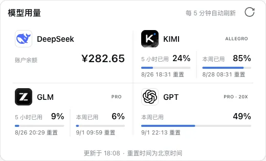</p>

#### 16 · 会话运行详情

展开当前会话的轮次、步骤、耗时、首 Token、输出速度和缓存命中。

<p align="center">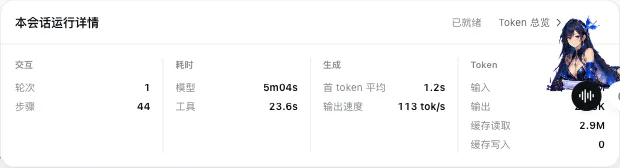</p>

#### 17 · Token 总览（[独立仓库](https://github.com/niushuanan/dsh-token-overview)）

按今天、近 7 天、本月或全部查看多客户端 Token、调用和成本趋势。

<p align="center">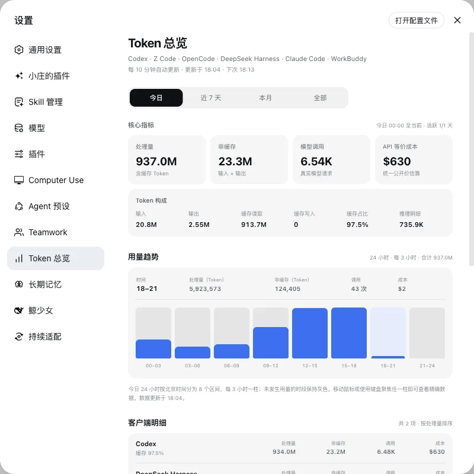</p>

## 数据、模型与更新

- 仓库和发行包不包含 API Key、登录信息、对话记录或本机 DSH 配置。
- Skill 导入、长期记忆维护和兼容适配默认使用低成本的 `deepseek-official/deepseek-v4-flash-vision-exp`；普通工作和聊天使用用户选择的模型。
- 持续适配保留原 DSH Home、对话和附件；候选版本失败时恢复源码与数据，只保留一份回滚快照并清理临时工作树。

## 开发与反馈

[开发指南](docs/development.zh.md) · [架构文档](docs/architecture.zh.md) · [贡献指南](CONTRIBUTING.zh.md) · [Issues](https://github.com/niushuanan/xiaozhuang-dsh/issues)

通用修复建议提交给 [DeepSeek Harness 上游](https://github.com/deepseek-ai/deepseek-harness)。本仓库公开源码和 Issues，但暂不接收外部 Pull Request。

## 许可证

[MIT](LICENSE) · [第三方依赖与许可证](THIRD_PARTY_NOTICES.md)
