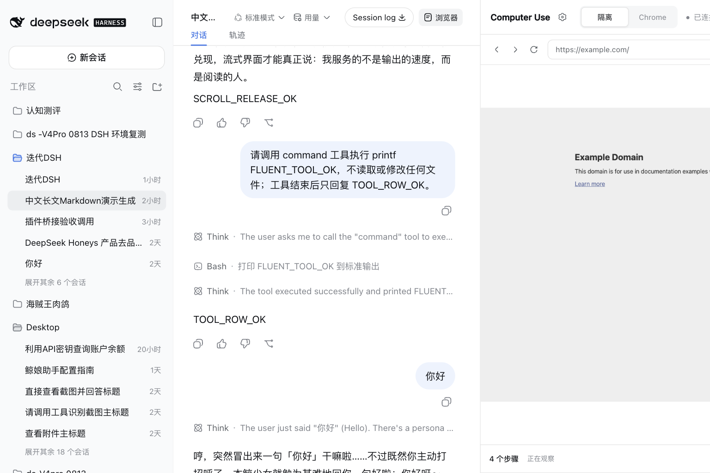
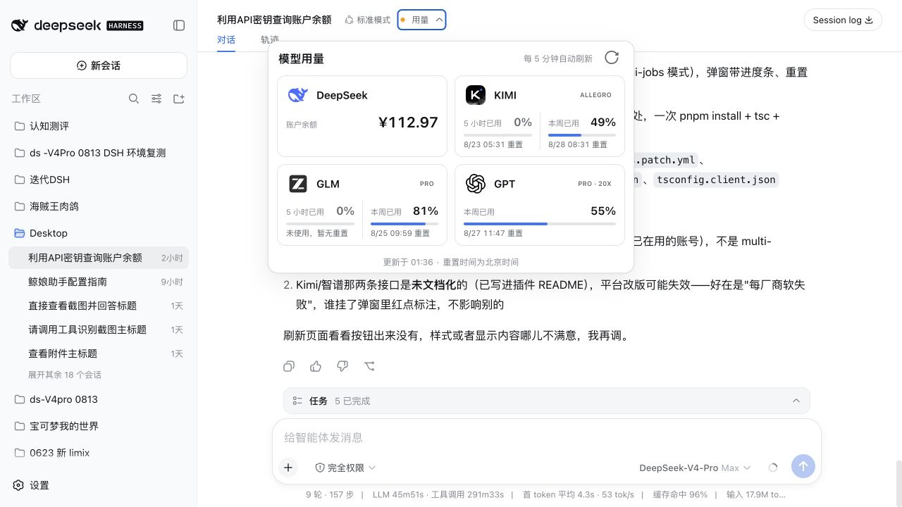

# Xiaozhuang DSH

[English](README.md) | 中文

Xiaozhuang DSH 是一个基于 [DeepSeek Harness](https://github.com/deepseek-ai/deepseek-harness) 的社区插件增强发行版。它保留上游“一切皆插件”的基础，并持续加入更适合本地 AI 工作的可观察、可控制和可扩展能力。

> 这是独立的社区项目，不是 DeepSeek 官方发行版。上游架构、许可证和署名均完整保留。

[下载最新版本](https://github.com/niushuanan/xiaozhuang-dsh/releases/latest) · [查看上游项目](https://github.com/deepseek-ai/deepseek-harness)

## 为什么做这个发行版

DeepSeek Harness 本身已经提供了丰富的智能体运行时、插件组合、会话、工具、模型适配器和 Web 工作区。这个仓库不替换这些基础，而是把新增能力做成原生插件或很窄的扩展点改造，让每项功能都可以独立理解、启用、移除和持续迭代。

产品优先级很直接：核心流程必须可用，常见问题能够恢复，界面足够紧凑，可以真正用于日常工作。

## 当前包含的增强

| 方向 | 解决什么问题 |
| --- | --- |
| **Computer Use** | 提供原生 macOS 桌面控制、隔离式 Playwright 浏览器、已连接 Chrome 控制，以及可调整宽度的产品内浏览器工作区。 |
| **Teamwork 与并行开发** | 支持配置 Codex 协作者，把独立任务放入隔离 Git worktree，分别实现和审查，再受控集成回主工作区。 |
| **模型用量** | 预加载 DeepSeek、KIMI、GLM 和当前 GPT 登录账号的用量，支持手动刷新、自动刷新、额度窗口与重置时间。 |
| **会话内实时控制** | 在已有对话中切换 Agent 预设，按模型选择合理思考强度，并把规划和团队状态放到更合适的位置。 |
| **可扩展输入区** | 为文件、文件夹、命令、技能和插件提供直接扩展点，同时保留产品原生输入流程。 |
| **模型输入路由** | 明确区分纯文本与原生视觉能力，让图片模型和视觉工具回退可以同时存在。 |
| **数字伙伴与 AI 语音输入** | 默认角色“鲸少女”常驻输入框上方，跟随 Agent 状态；支持蓝黑皮肤、自定义名字、麦克风听写、模型文字整理、快捷键和本机使用统计。 |
| **多窗口并行** | 从任一会话菜单另开完整 DSH 工作窗口，最多同时四个；各窗口独立切换、输入和发送，主窗口独占数字伙伴。 |
| **对话导出与分享** | 当前对话既可导出完整文本记录，也可生成忽略思考与工具过程的单张 PNG 长图。 |
| **项目 Agent 规则** | 在鲸少女设置页直接读取、创建和编辑当前项目根目录的 `AGENTS.md`，并避免覆盖外部编辑。 |

这些能力继续使用 DSH 的普通包与 Profile patch layer 组装，没有另起一套平行应用。主要新增代码位于 [`packages/computer-use/`](packages/computer-use/)、[`packages/client/ui-computer-use/`](packages/client/ui-computer-use/)、[`packages/client/ui-provider-quota/`](packages/client/ui-provider-quota/)、[`packages/client/ui-product-companion/`](packages/client/ui-product-companion/)、[`packages/client/ui-multi-window/`](packages/client/ui-multi-window/)、[`packages/session-query/session-log-export/`](packages/session-query/session-log-export/)，以及 [`packages/`](packages/) 下的子代理、会话、预设和插件加载扩展。

### Computer Use 工作区



### 模型用量面板



### 多窗口并行

在任一非空会话的 `…` 菜单选择“另开窗口”，即可保留主窗口的当前工作，同时用一个完整附属窗口打开该会话。主窗口与附属窗口的当前会话、输入草稿和发送操作彼此独立；总数达到四个时入口会明确禁用。附属窗口不复制数字伙伴，关闭插件也不会强制关闭已经在工作的窗口。

### 数字伙伴“鲸少女”

“鲸少女”是默认名字，“鲸”来自 DeepSeek 的鲸系视觉符号。这个名字不会锁死用户：在设置中进入以当前角色名显示的栏目即可修改；保存后左侧目录、页内标题、角色辅助名称、右键菜单和显示开关立即统一，刷新后仍然保留。底层插件 id 始终稳定，改名不会影响热插拔或已有偏好。

她常驻在真实输入框右侧正上方，身体可见轮廓刚好贴住上沿，不遮挡输入文字。动作只跟随 Agent 状态和输入框的真实位置，不被鼠标悬停驱动。切换对话本身不会触发传送：插件会等待切换期的输入框布局稳定，只有最终锚点确实改变至少 6 px 才开门；瞬时落到底部又回到原位会被直接忽略。空闲、专注、等待和完成都使用全趴姿动作；当发送消息或布局变化使输入框真正换位时，12 张重新绘制的近景传送帧会保持和趴姿相同的人物宽度，让传送门逐步遮挡身体，而不是把她缩成远景小人。空闲呼吸、专注、等待、完成和传送运行帧按 24 fps 曝光表由 `requestAnimationFrame` 对齐显示器刷新，并预解码到单一图片层，减少切帧闪烁。蓝色／黑色皮肤、标准／放大尺寸、任务状态气泡，以及单击、双击、右键的快捷动作都可在独立设置页管理。默认右键菜单紧贴角色下方，只保留一行使用当前自定义名字的关闭入口，不再添加图标、分隔线或警示色。

数字伙伴左侧的波形按钮现在可以直接听写。识别结果按当前光标位置回填真实输入框；用户可关闭智能整理，直接使用原始识别，也可从已经接入 DSH 的模型中选择文字处理模型，并用一段自定义要求定义去口头禅、整理语序、转述或翻译方式。默认 `⌥ Space` 是 DSH 窗口内快捷键，单击、双击或右键也可以绑定语音输入。模型整理失败时不会丢失内容，而是自动回填原始听写。设置页只保存累计次数、字数和预计节省时间，不保存录音或听写正文。

<a id="run"></a>

## 下载与运行

### 推荐：下载发行包

打开 [Releases](https://github.com/niushuanan/xiaozhuang-dsh/releases/latest)，下载 `xiaozhuang-dsh-v0.2.0-prebuilt-source.tar.gz`。发行包同时包含源码和对应提交已经构建好的 Host、Client 与 Web 产物，首次运行前不需要再在本机执行构建。

当前打包版本：[Xiaozhuang DSH v0.2.0](https://github.com/niushuanan/xiaozhuang-dsh/releases/tag/xiaozhuang-v0.2.0) · [直接下载发行包](https://github.com/niushuanan/xiaozhuang-dsh/releases/download/xiaozhuang-v0.2.0/xiaozhuang-dsh-v0.2.0-prebuilt-source.tar.gz) · [SHA-256 校验文件](https://github.com/niushuanan/xiaozhuang-dsh/releases/download/xiaozhuang-v0.2.0/SHA256SUMS.txt)。

运行要求：

- Node.js `^22.19.0` 或 `>=24.0.0`
- 通过 Corepack 使用 pnpm `11.7.0`
- 开发和 Teamwork worktree 功能需要 Git
- 只有启用桌面 Computer Use 时，才需要授予 macOS 辅助功能与屏幕录制权限

```sh
tar -xzf xiaozhuang-dsh-v0.2.0-prebuilt-source.tar.gz
cd xiaozhuang-dsh-v0.2.0
corepack enable
pnpm install --frozen-lockfile
pnpm dsh web
```

Web UI 默认启动在 `http://127.0.0.1:3080`。

<a id="run-from-source"></a>

### 从 Git 源码运行

```sh
git clone https://github.com/niushuanan/xiaozhuang-dsh.git
cd xiaozhuang-dsh
corepack enable
pnpm install --frozen-lockfile
pnpm run build:official
pnpm dsh web
```

## 配置与隐私

仓库和发行包不包含 API Key、登录会话、账号 Token、对话数据或本机 DSH Profile 状态。模型提供方和系统权限都需要在使用者自己的电脑上配置。模型用量插件只在运行时读取支持的本机账号配置，不会把凭据暴露给浏览器。语音输入首次使用时会由浏览器请求麦克风权限；音频交给浏览器的语音识别能力处理，插件本身不保存录音。只有开启“智能整理文字”后，识别出的文字才会发送给用户选定的模型。

Computer Use 和外部协作者都是可选能力。各包 README 记录了权限、提供方要求、失败方式和已知限制。

## 持续迭代

这个仓库会持续公开已经在日常本地工作中证明有用的插件改进。后续会重点完善整机 Token 总览、更清楚的运行详情、更高效的输入区菜单、更流畅的输出体验，以及更简单的精选插件安装方式。AI 语音输入已经进入可用版本，后续迭代会继续补充更多本地识别选项与系统级快捷键能力。

新增能力仍然遵循插件优先：必须解决一个用户能感知的任务，保留上游运行主干，并且可以在不破坏其他流程的情况下移除。

## 开发与贡献

修改包之前请先阅读[开发指南](docs/development.zh.md)、[架构文档](docs/architecture.zh.md)和[贡献指南](CONTRIBUTING.zh.md)。适用于所有使用者的通用修复，仍建议提交给 [DeepSeek Harness](https://github.com/deepseek-ai/deepseek-harness) 上游。

## 许可证

[MIT](LICENSE)。第三方依赖与许可证见 [THIRD_PARTY_NOTICES.md](THIRD_PARTY_NOTICES.md)。
